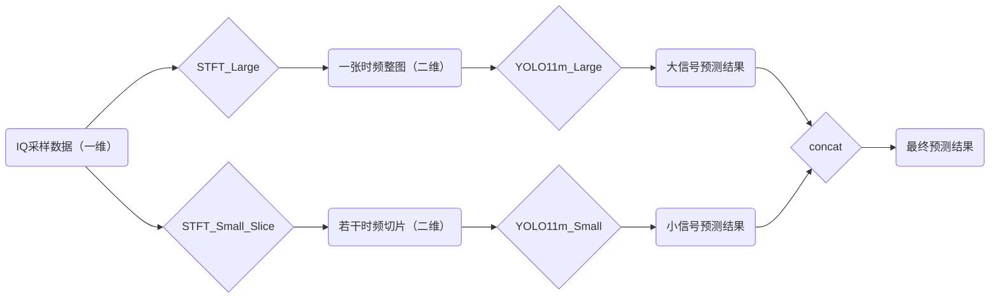
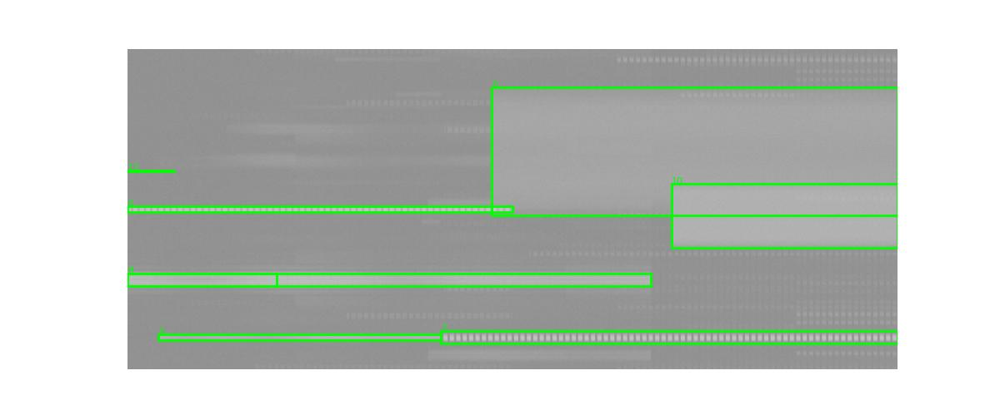
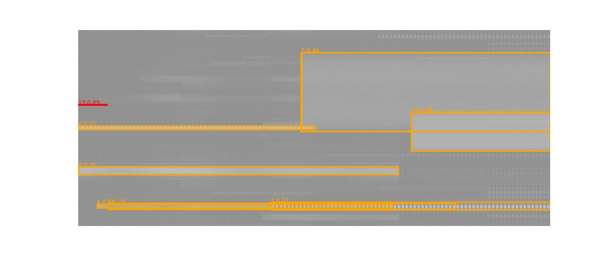

> 老师要求：
> 1. 当前毕设进展
> 2. 后续毕设工作计划
>       - 每周小目标
>       - 每月阶段性目标

 

> 师兄要求：
> 1. 场景
> 2. 现有文献和工作
> 3. 数据分析及其难点
> 4. 针对难点提出的框架算法
> 5. 结果
> 6. 待解决的问题

---

目录：
[TOC]

---

# 1. 当前毕设进展

## 1.1 数据集分析

**在官方数据集配套的 data_intro 中可知：**
1. 数据共7500条；
2. 采样率可能取值为 5MHz / 20MHz / 30MHz / 40MHz / 50MHz / 80MHz；
3. 采样时长可能取值为 20ms / 40ms / 60ms / 80ms / 100ms / 150ms；
4. 一条数据中最少包含1个信号，最多包含8个信号，这些信号可能在时域和频域上存在重叠，也就是说存在信号之间的干扰；

**通过决赛路演视频得到补充信息：** 共 14 类信号
| Class | 信号类型 | 工作模式 | 调制方式 | 带宽(MHz)              |
| ----- | -------- | -------- | -------- | ---------------------- |
| 0     | WiFi     | HT20     | QPSK     | 20.0                   |
| 1     | WiFi     | HT20     | 16QAM    | 20.0                   |
| 2     | WiFi     | HT20     | 64QAM    | 20.0                   |
| 3     | WiFi     | HT40     | QPSK     | 20.0 / 40.0            |
| 4     | WiFi     | HT40     | 16QAM    | 40.0                   |
| 5     | WiFi     | HT40     | 64QAM    | 40.0                   |
| 6     | BLE      | LE       | GFSK     | 1.0                    |
| 7     | BLE      | LE       | GFSK     | 2.0                    |
| 8     | ZigBee   | standard | OQPSK    | 2.0                    |
| 9     | LoRa     | standard | CSS      | 0.0523 / 0.0625 / 0.25 |
| 10    | custom   | /        | QPSK     | 0.3 / 0.5 / 10.0       |
| 11    | custom   | /        | 16QAM    | 1.6 / 7.56 / 10.0      |
| 12    | custom   | /        | AM       | 0.006 / 0.2            |
| 13    | custom   | /        | FM       | 0.04 / 0.12 / 0.2      |

**难点：**
1. 每条数据的点数都非常多（10^6级别），考验数据预处理；
2. 同一条数据中包含的信号数量可能较多（最多8个），且带宽相差很大（最小0.006MHz，最大40.0MHz），信号强度差异也很大，考验数据预处理；
3. 同一条数据内的信号存在时域和频域上的重叠（即干扰），考验检测模型；
4. 经过观察，Class 9同一类型的不同带宽下的时频图特征不同，即存在不同特征不同模样的信号同属一种类型，考验检测模型；
5. （待补充）

**脚本分析：**
--- (1.1) 数据层面统计 ---

(1.1.1) 采样率统计 (Sampling Rate):
  5.0 Ms/s: 1260 个
  20.0 Ms/s: 1485 个
  30.0 Ms/s: 1506 个
  40.0 Ms/s: 1063 个
  50.0 Ms/s: 1192 个
  80.0 Ms/s: 994 个

(1.1.2) 采样时间统计 (Duration):【存在不规范采样时间的数据】
  2.0 ms: 1 个
  4.0 ms: 3 个
  5.0 ms: 3 个
  6.0 ms: 3 个
  7.0 ms: 9 个
  8.0 ms: 5 个
  9.0 ms: 4 个
  9.2 ms: 1 个
  9.9 ms: 1 个
  10.0 ms: 2 个
  10.68 ms: 1 个
  11.0 ms: 3 个
  11.7 ms: 1 个
  12.0 ms: 13 个
  12.6 ms: 1 个
  13.0 ms: 10 个
  13.5 ms: 1 个
  14.0 ms: 10 个
  14.64 ms: 1 个
  14.92 ms: 1 个
  15.0 ms: 15 个
  16.0 ms: 12 个
  16.72 ms: 1 个
  16.96 ms: 1 个
  17.0 ms: 19 个
  17.68 ms: 1 个
  18.0 ms: 50 个
  19.0 ms: 16 个
  20.0 ms: 3145 个
  40.0 ms: 824 个
  53.0 ms: 1 个
  60.0 ms: 798 个
  66.0 ms: 1 个
  74.0 ms: 1 个
  76.0 ms: 1 个
  79.0 ms: 1 个
  80.0 ms: 831 个
  82.8 ms: 1 个
  87.0 ms: 1 个
  88.0 ms: 1 个
  89.0 ms: 1 个
  90.0 ms: 1 个
  92.0 ms: 1 个
  93.0 ms: 1 个
  97.0 ms: 1 个
  99.0 ms: 2 个
  100.0 ms: 813 个
  105.0 ms: 1 个
  121.0 ms: 1 个
  127.56 ms: 1 个
  133.0 ms: 2 个
  136.64 ms: 1 个
  140.0 ms: 1 个
  141.0 ms: 1 个
  145.0 ms: 1 个
  147.0 ms: 2 个
  148.0 ms: 2 个
  149.0 ms: 1 个
  150.0 ms: 871 个
  
(1.1.4) 单个数据中信号个数 (Signal Count per File):
  包含 1 个信号: 802 个文件
  包含 2 个信号: 767 个文件
  包含 3 个信号: 871 个文件
  包含 4 个信号: 1700 个文件
  包含 6 个信号: 1675 个文件
  包含 8 个信号: 1685 个文件

(1.1.5) 单个数据中信号种类数 (Unique Signal Types per File):
  包含 1 种信号: 922 个文件
  包含 2 种信号: 1124 个文件
  包含 3 种信号: 1556 个文件
  包含 4 种信号: 1572 个文件
  包含 5 种信号: 1238 个文件
  包含 6 种信号: 810 个文件
  包含 7 种信号: 244 个文件
  包含 8 种信号: 34 个文件

--- (1.2) 信号层面统计 (Signal Level) ---

[Class 0] 总数: 1645
  占用频宽 (Bandwidth) 分布:
    20.0 MHz: 1645 个
  占用时间 (Duration) 分布:
    （省略，1ms ~ 125ms）

[Class 1] 总数: 1596
  占用频宽 (Bandwidth) 分布:
    20.0 MHz: 1596 个
  占用时间 (Duration) 分布:

[Class 2] 总数: 1653
  占用频宽 (Bandwidth) 分布:
    20.0 MHz: 1653 个
  占用时间 (Duration) 分布:

[Class 3] 总数: 693
  占用频宽 (Bandwidth) 分布:
    20.0 MHz: 346 个
    40.0 MHz: 347 个
  占用时间 (Duration) 分布:

[Class 4] 总数: 709
  占用频宽 (Bandwidth) 分布:
    40.0 MHz: 709 个
  占用时间 (Duration) 分布:

[Class 5] 总数: 701
  占用频宽 (Bandwidth) 分布:
    40.0 MHz: 701 个
  占用时间 (Duration) 分布:

[Class 6] 总数: 3580
  占用频宽 (Bandwidth) 分布:
    1.0 MHz: 3580 个
  占用时间 (Duration) 分布:

[Class 7] 总数: 3484
  占用频宽 (Bandwidth) 分布:
    2.0 MHz: 3484 个
  占用时间 (Duration) 分布:

[Class 8] 总数: 7035
  占用频宽 (Bandwidth) 分布:
    2.0 MHz: 7035 个
  占用时间 (Duration) 分布:

[Class 9] 总数: 7186
  占用频宽 (Bandwidth) 分布:
    0.0523 MHz: 2689 个
    0.0625 MHz: 915 个
    0.25 MHz: 3582 个
  占用时间 (Duration) 分布:

[Class 10] 总数: 1748
  占用频宽 (Bandwidth) 分布:
    0.3 MHz: 289 个
    0.5 MHz: 273 个
    10.0 MHz: 1186 个
  占用时间 (Duration) 分布:

[Class 11] 总数: 1769
  占用频宽 (Bandwidth) 分布:
    1.6 MHz: 293 个
    7.56 MHz: 290 个
    10.0 MHz: 1186 个
  占用时间 (Duration) 分布:

[Class 12] 总数: 1783
  占用频宽 (Bandwidth) 分布:
    0.006 MHz: 574 个
    0.2 MHz: 1209 个
  占用时间 (Duration) 分布:

[Class 13] 总数: 1697
  占用频宽 (Bandwidth) 分布:
    0.04 MHz: 524 个
    0.12 MHz: 585 个
    0.2 MHz: 588 个
  占用时间 (Duration) 分布:

---

## 1.2 总体方案

---

## 1.3 基线方案

### 1.3.1 实验方案

### 1.3.2 实验结果

### 1.3.3 新发现的问题

1. 重叠标签

### 1.3.4 改进想法
1. 图片保存格式
   1. jpg【目前】 / png
2. STFT参数设置
   1. Mode 1：固定窗长【目前】
   2. Mode 2：自适应窗长-逼近正方形
   3. Mode 3：自适应窗长-固定频率分辨率
3. 其它设置
   1. 坐标：Linear【目前】/ dB
   2. 归一化：Sample【目前】/ Global
2. 模型版本
   1. YOLO11n【目前】/ YOLO11s/ YOLO11m / YOLO11l / 基于 Transformer 的 DETR 及其改进版本

对于重叠标签，训练时可以通过微调位置避免被检查，但是在NMS时怎么办？所以考虑DETR。

---

## 1.4 改进方案v1

### 1.4.1 针对之前的问题 / 之前的想法
1. STFT参数设置
   1. Mode 1：固定窗长【目前】
   2. Mode 2：自适应窗长-逼近正方形
   3. Mode 3：自适应窗长-固定频率分辨率
2. 其它设置
   1. 坐标：Linear【目前】/ dB
   2. 归一化：Sample【目前】/ Global

### 1.4.2 实验方案
（统一使用 jpg + YOLO11n）

- [x] 方案1-1：Mode 1(1024) + Linear + Sample Norm 【目前】
- [ ] 方案1-2：Mode 1(1024) + dB + Sample Norm
- [ ] 方案1-3：Mode 1(1024) + Linear + Global Norm
- [ ] 方案1-4：Mode 1(1024) + dB + Global Norm
 
- [x] 方案2-1：Mode 2 + Linear + Sample Norm
- [ ] 方案2-2：Mode 2 + dB + Sample Norm
- [ ] 方案2-3：Mode 2+ Linear + Global Norm
- [ ] 方案2-4：Mode 2 + dB + Global Norm
 
- [x] 方案3-1：Mode 3(20kHz) + Linear + Sample Norm
- [ ] 方案3-2：Mode 3(20kHz) + dB + Sample Norm
- [ ] 方案3-3：Mode 3(20kHz) + Linear + Global Norm
- [x] 方案3-4：Mode 3(20kHz) + dB + Global Norm

### 1.4.3 实验结果

| mAP50:95 | 1-1       | 2-1       | 3-1       | 3-4       |
| -------- | --------- | --------- | --------- | --------- |
| **all**  | **0.383** | **0.578** | **0.543** | **0.517** |
| 0        | 0.495     | 0.59      | 0.521     | 0.543     |
| 1        | 0.303     | 0.408     | 0.355     | 0.329     |
| 2        | 0.502     | 0.57      | 0.555     | 0.515     |
| 3        | 0.468     | 0.73      | 0.66      | 0.598     |
| 4        | 0.524     | 0.713     | 0.718     | 0.739     |
| 5        | 0.59      | 0.692     | 0.692     | 0.671     |
| 6        | 0.387     | 0.805     | 0.788     | 0.74      |
| 7        | 0.444     | 0.835     | 0.847     | 0.768     |
| 8        | 0.557     | 0.897     | 0.907     | 0.868     |
| 9        | 0.14      | 0.273     | 0.181     | 0.161     |
| 10       | 0.303     | 0.538     | 0.442     | 0.461     |
| 11       | 0.48      | 0.723     | 0.675     | 0.683     |
| 12       | 0.108     | 0.221     | 0.181     | 0.12      |
| 13       | 0.0647    | 0.0965    | 0.0754    | 0.042     |

| mAP50:95 | 2-1 YOLO11m |
| -------- | ----------- |
| **all**  | **0.617**   |
| 0        | 0.559       |
| 1        | 0.386       |
| 2        | 0.6         |
| 3        | 0.745       |
| 4        | 0.798       |
| 5        | 0.739       |
| 6        | 0.862       |
| 7        | 0.903       |
| 8        | 0.941       |
| 9        | 0.354       |
| 10       | 0.538       |
| 11       | 0.745       |
| 12       | 0.321       |
| 13       | 0.151       |

### 1.4.4 未解决的问题 / 新发现的问题
未解决的问题：
...

新发现的问题：
...

### 1.4.5 改进想法
1. 图片保存格式
   1. jpg【目前】 / png
2. 模型版本
   1. YOLO11n【目前】/ YOLO11s/ YOLO11m / YOLO11l / 基于 Transformer 的 DETR 及其改进版本

---

## 1.5 改进方案v2

### 1.5.1 针对之前的问题
1. 图片保存格式
   1. jpg【目前】 / png
2. 模型版本
   1. YOLO11n【目前】/ YOLO11s/ YOLO11m / YOLO11l / 基于 Transformer 的 DETR 及其改进版本

### 1.5.2 实验方案
（统一其他设置：Mode 3(20kHz) + dB + Global Norm）

- [ ] 方案4-1：jpg + YOLO11n【目前】（同方案3-4）
- [ ] 方案4-2：png + YOLO11n
 
- [ ] 方案5-1：jpg + YOLO11s
- [ ] 方案5-2：png + YOLO11s
 
- [x] 方案6-1：jpg + YOLO11m
- [ ] 方案6-2：png + YOLO11m

(YOLO11l有点太大了，暂时没有实验)

### 1.5.3 实验结果
（使用 png 时训练非常不稳定且非常慢，故无结果）

| mAP50:95 | 4-1 | 4-2 | 5-1 | 5-2 | 6-1                                     | 6-2 |
| -------- | --- | --- | --- | --- | --------------------------------------- | --- |
| **all**  |     | /   |     | /   | **0.574**                               | /   |
| 0        |     | /   |     | /   | 0.527                                   | /   |
| 1        |     | /   |     | /   | 0.365                                   | /   |
| 2        |     | /   |     | /   | 0.604                                   | /   |
| 3        |     | /   |     | /   | 0.781                                   | /   |
| 4        |     | /   |     | /   | 0.758                                   | /   |
| 5        |     | /   |     | /   | 0.713                                   | /   |
| 6        |     | /   |     | /   | 0.814                                   | /   |
| 7        |     | /   |     | /   | 0.881                                   | /   |
| 8        |     | /   |     | /   | 0.92                                    | /   |
| 9        |     | /   |     | /   |  0.209   | /   |
| 10       |     | /   |     | /   | 0.528                                   | /   |
| 11       |     | /   |     | /   | 0.688                                   | /   |
| 12       |     | /   |     | /   |  0.192   | /   |
| 13       |     | /   |     | /   |  0.0629  | /   |

### 1.5.4 未解决的问题 / 新发现的问题
未解决的问题：
...

新发现的问题：
1. Class 9 / Class 12 / Class 13 窄带信号的 mAP50:95 低

### 1.5.5 改进想法

---

## 1.6 改进方案v3（脚伤前）

### 1.6.1 针对之前的问题 / 之前的想法
对于 窄带信号难检测 问题，提出**数据预处理**层面和**检测网络**层面的改进：（基于 YOLO11m）
1. 数据预处理：
   1. 数据经过固定频率分辨率的STFT后，再将得到的时频图按(640,640)切片，之后再输入检测网络，最后将每个切片的检测结果拼接得到最终检测结果；
2. 检测网络：
   1. 加入P2层；
   2. 将部分Conv层改为SPD-Conv层；

### 1.6.2 实验方案
方案7：按(640,640)切片
方案8：按(640,640)切片 + 加入P2层
方案9：按(640,640)切片 + SPDConv

### 1.6.3 实验结果
（系统未搭建完全，没有测试数据，只有训练时的数据）

方案7：mAP50:95 = 0.62
方案8：mAP50:95 = 0.613
方案9：mAP50:95 = 0.59

### 1.6.4 未解决的问题 / 新发现的问题
方案7之所以有提高，是因为 Class 6 / Class 7 / Class 8 三种信号在切片后缩放到了合适的尺寸，检测率提高；但宽带信号检测率有所下降；

未解决的问题：
1. 窄带信号检测率仍然很低；

新发现的问题：
1. 切片后宽带信号检测率反而下降，因为
   1. 切片后宽带信号通常都只有局部；
   2. 后处理时需要拼接，可能有疏漏；

说明只要频率分辨率不变，就算引入更大的特征图（P2）或能够减少信息流失的下采样方式（SPD-Conv代替池化），也不能提高窄带信号检测率。

### 1.6.5 改进想法
切片后仍然窄带信号检测率低，所以一定需要降低STFT的频率分辨率；

---

## 1.7 改进方案v4（回校后实现）

### 1.7.1 针对之前的问题 / 之前的想法

### 1.7.2 实验方案
对于 窄带信号难检测 问题，提出**系统结构**层面上的改进：

**解释**：
由于宽带信号和窄带信号的带宽差距过大（最大40MHz，最小0.006MHz），若使用同一固定频率分辨率则无法兼顾。所以考虑引入类似MoE的思想，将系统分为 Large 分支和 Small 分支，分别检测大信号和小信号。

**两个分支分别关注的信号种类及其带宽**：

<table>
<tr>
<td valign="top">

**Large:**

| Class | Bandwidth (MHz) |
| :--- | :--- |
| 0 | 20.0 |
| 1 | 20.0 |
| 2 | 20.0 |
| 3 | 20.0 / 40.0 |
| 4 | 40.0 |
| 5 | 40.0 |
| 6 | 1.0 |
| 7 | 2.0 |
| 8 | 2.0 |
| 10 | 10.0 |
| 11 | 1.6 / 7.56 / 10.0 |

</td>
<td valign="top">

**Small:**

| Class | Bandwidth (MHz) |
| :--- | :--- |
| 9 | 0.0523 / 0.0625 / 0.25 |
| 10 | 0.3 / 0.5 |
| 12 | 0.006 / 0.2 |
| 13 | 0.04 / 0.12 / 0.2 |

</td>
</tr>
</table>

**两个分支的STFT的参数设置**：
1. STFT_Large
   1. STFT模式：Mode 3(20kHz)
   2. 坐标：dB
   3. 归一化策略：Global Norm(-140dB ~ 30dB)
2. STFT_Small_Slice
   1. STFT模式：Mode 3(5kHz)
   2. 坐标：dB
   3. 归一化策略：Global Norm(-140dB ~ 30dB)
   4. Slice策略：
      1. 切片长宽：(640, 640)
      2. 切片重叠率：0.2

**为什么 Large 分支固定频率分辨率为 20kHz，而 Small 分支固定频率分辨率为 5kHz：**
（放表格）

**为什么 Small 分支需要 Slice：**
根据上表可知，为了频率分辨率够小，窗长度则会较大，若不 Slice 而直接输入训练，则还是会缩放到 imgsz=640，会将放大了的小信号再次缩小，回到不可检出的情况。

**两个分支的检测模型**：
均使用 YOLO11m。虽然使用相同的模型，但是两个分支的检测模型是独立的，从而不会互相影响。

### 1.7.3 实验结果

**注：**
因为最后的结果是两条分支拼接得到的，不能使用 model.val 来直接测试，无法使用与之前一模一样的方法得到 mAP50:95，以下结果是通过自己编写的调用了ultralytics框架的原生AP计算函数的程序得到的 mAP50:95，还未测试是否与 model.val 的方法得到的是否一致。

| mAP50:95 | 改进v3     |
| -------- | ---------- |
| **all**  | **0.6647** |
| 0        | 0.4632     |
| 1        | 0.3920     |
| 2        | 0.5563     |
| 3        | 0.7442     |
| 4        | 0.6751     |
| 5        | 0.6889     |
| 6        | 0.8210     |
| 7        | 0.9068     |
| 8        | 0.9064     |
| 9        | 0.7417     |
| 10       | 0.5868     |
| 11       | 0.5749     |
| 12       | 0.7380     |
| 13       | 0.5098     |

  <h3>Ground Truth</h3>
  

  <h3>Prediction</h3>
  

### 1.7.4 改进想法
1. 对 STFT_Large 和 STFT_Small 独立寻找最适合的配置，以下考虑：
   1. 参数设置
      1. 大信号强度较弱，所以可能选择 dB 坐标更容易检出，选择的 Global Norm 的 min_dB 和 max_dB 也可以更低一些；
      2. 小信号强度较强，所以可能选择 Linear 坐标更容易检出（大信号被隐去），选择的 Global Norm 的 min_dB 和 max_dB 也可以更高一些；
   2. 模型
      3. Large 分支均为整片，样本数量为 7500，不多，选择 YOLO11m；
      4. Small 分支进行了切片，样本数量 > 15000，可以尝试 YOLO11l；
2. 模型版本
   1. YOLO11m【目前】/ 基于 Transformer 的 DETR 及其改进版本；
3. 测试 自己编写的 mAP50:95 计算脚本是否与官方的结果相同；
4. 训练设置：学习率调度器，训练轮数等；
5. 数据增强设置（Mosaic、Mixup）：需要考虑时频图与真实世界图片的区别，选择符合物理规律的增强方式；

**从结果上看，大信号的mAP反而有点下降，需要将 Large 分支与之前的方案（2-1）做对比，改进方向之一；**

---

# 2. 后续毕设工作计划

比赛前十二名的成绩：

今天是 2026年01月16日，是2026年的第三周周五。

## 2.1 每月阶段性目标

| 月份  | 目标                                                                        |
| ----- | --------------------------------------------------------------------------- |
| 1月份 | 搭建双分支系统并改进；                                                      |
| 2月份 | 健康过年；继续改进双分支系统；整理实验数据；                                |
| 3月份 | 基于当前的双分支系统**完成中期检查报告及中期答辩PPT**；继续改进双分支系统； |
| 4月份 | 继续改进双分支系统；尝试决赛其它队伍的可行方案；                            |
| 5月份 | **完成毕业设计论文及结题答辩PPT**；                                         |

## 2.2 每周小目标

| 周数             | 目标                                                                     |
| ---------------- | ------------------------------------------------------------------------ |
| 第3周            | 补齐之前缺少的实验结果、总结；                                           |
| 第4周            | 在预处理参数设置、模型选择、训练设置、数据增强设置等层面改进双分支系统； |
| 第5周            | 在预处理参数设置、模型选择、训练设置、数据增强设置等层面改进双分支系统； |
| **第6周 (2月)**  | 在预处理参数设置、模型选择、训练设置、数据增强设置等层面改进双分支系统； |
| 第7周            | 健康过年；整理实验结果；撰写中期检查报告；                               |
| 第8周            | 健康过年；整理实验结果；撰写中期检查报告；                               |
| 第9周            | 继续改进双分支系统；检查是否遗漏实验，补齐结果；撰写中期检查报告；       |
| **第10周 (3月)** | 完成中期检查报告及答辩PPT；整理决赛路演中其它队伍的可行方案；            |
| 第11周           | （待续）                                                                 |
| 第12周           | （待续）                                                                 |