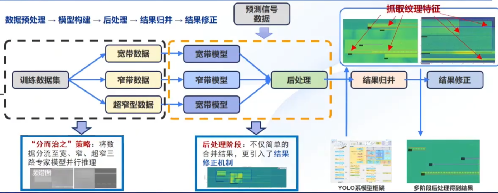
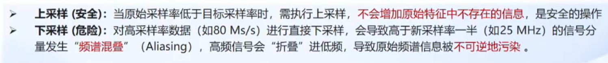
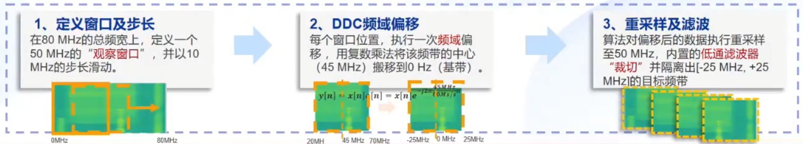
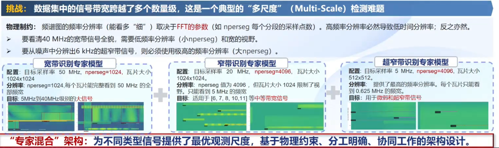
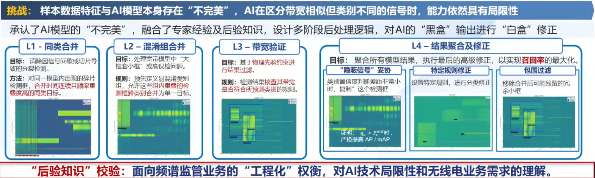
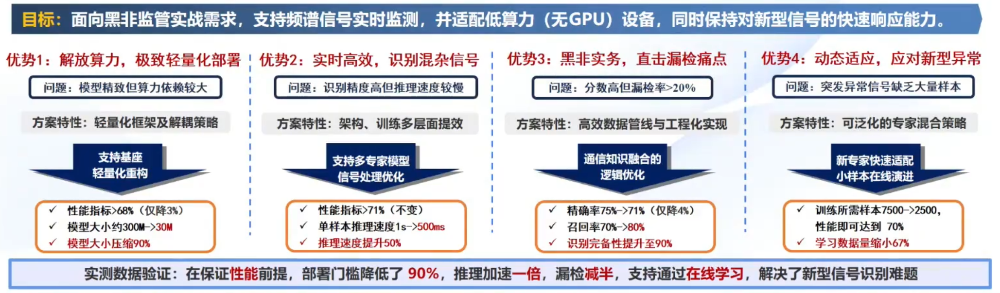

## 主要技术思路：

（超窄！考虑把 Class12的0.006MHz 和 Class13的0.04MHz(看看要不要包含0.12MHz) 再分一条支路，频率分辨率比现在的small分支的5kHz更小）

## 关键技术1：融合信号处理理论的预处理
挑战：原始数据集中包含多种采样率（5Ms/s, 20Ms/s, ..., 80Ms/s）；但是AI训练需要固定尺寸的输入
方案：

（这一段说的挺有道理，但是我不知道有什么用）
（意思是都统一成50MHz吗？）

## 关键技术2：多尺度专家“分而治之”协同

（感觉可以尝试一下加一个宽带识别专家，看看Class0/1/2的区分怎么样）
（感觉可以尝试一下加一个超窄带识别专家，看看Class12/13的识别怎么样）

（其实没有太懂全流程）

## 关键技术3：融合后验知识的工程优化

（感觉这个很好，但是对我现在的帮助不大，因为我现在的信号混淆都发生在相同带宽。）

## 方案优势与特色
“更轻，更快，更稳，更灵”

（标题应该是“黑飞”吧）
（模型轻量化？）