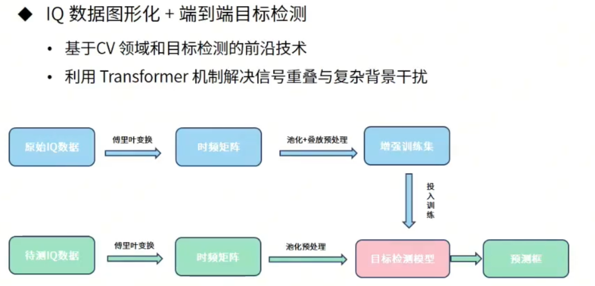
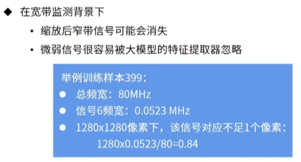
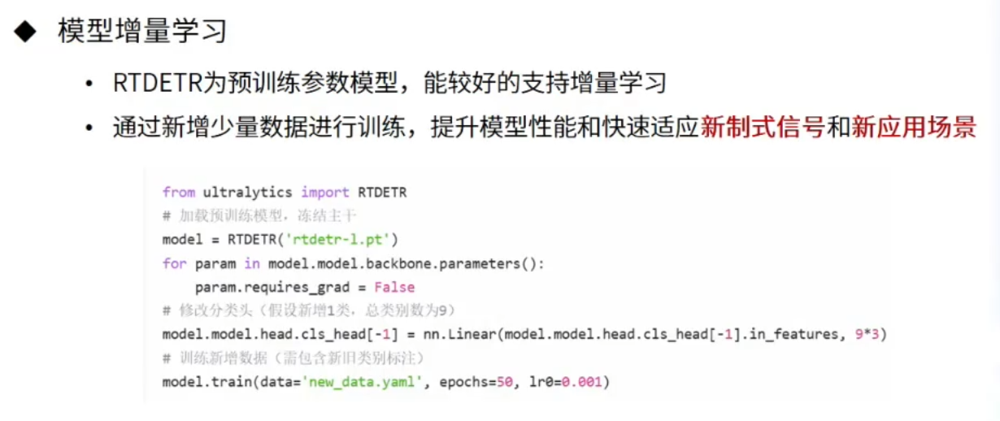

## 总体技术路线

1. 
2. 模型适应性

## 挑战1：信号重叠干扰
导致：
1. 高重叠漏检：多个目标紧密排列时，NMS会误删相邻目标的框；
2. ...

解决：使用DETR
1. 避开传统目标检测模型的NMS后处理

## 挑战2：多分辨率时频谱图
数据的采样率和采样时长多样：...

解决：RT-DETR模型的高效混合编码器（为什么能解决？有什么逻辑？没懂）

## 挑战3：窄带信号的定位与识别

（这个具体的计算很好）

解决：最大池化（max pooling）

## 挑战4：数据量不多，类别不均衡
...（数据）

解决：数据增强
1. 对训练数据按照 相同采样率 / 相同时长 分组；
   （为什么要相同时长？我觉得要相同采样率是因为频率分辨率相同。但是要不要观测带宽完全相同呢？如果纯CV，那无所谓；如果结合通信知识，那么不同制式的信号有些不会出现在某些位置，或者中心频率是离散值。个人偏向纯CV）
2. 在同一组随机对样本两两合并（在IQ数据层面上线性相加，标签同时合并），生成新的训练样本；

## 智能
