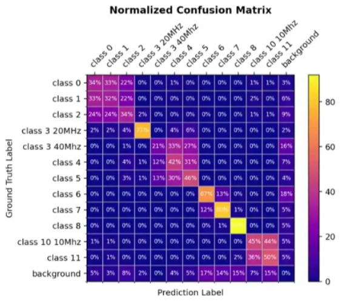
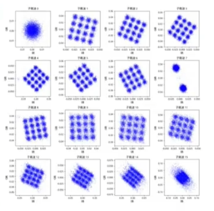
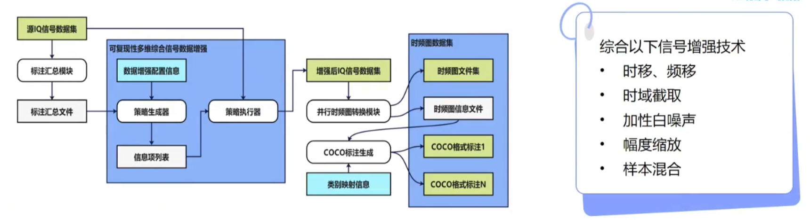
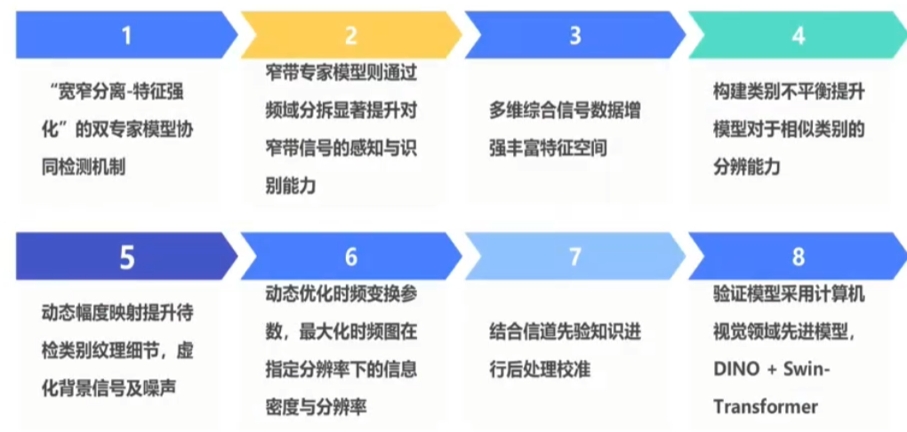

## 基线模型、实验结果及分析
基线模型：Faster R-CNN + ResNet50

实验结果：

（发现它的Class 6/7会混淆，而我的不会 —— 会不会是模型影响混淆？）

两大难题：
1. 窄带信号识别难；
2. 相似类别混淆严重；

## 难题1：

## 难题2：
按带宽拆开：

“我们甚至去解OFDM的子载波”
（这个图有意思）

## 多维综合信号增强

“在增强时考虑到难识别的样本多一点，故意构造类别不平衡”

## 方案细节

“细节方面提分较多”
1. “构造类别不平衡”
2. “时频图尽量铺满”
3. “宽带时频图用dB，窄带时频图用线性”