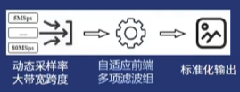
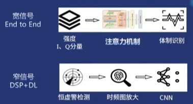
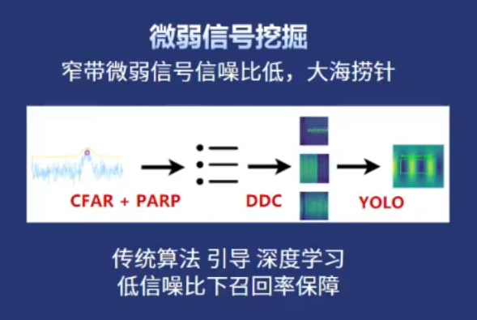
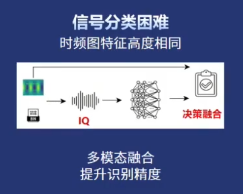

## 痛点分析
1. 挤：多源信号高重叠与强干扰
2. 乱：
   1. 变采样率；
   2. 制式未知（无先验知识）；
      > 盲识别，所以不应该去尝试OFDM解调WiFi信号；
   4. 窄带信号 / 短时信号（跳频信号）

## 多尺度智能感知架构

（这应该就是我的STFT_MODE=2的时候的“自适应”）

## 针对两个难题
1. 窄带信号难识别
   
2. 信号分类困难
   
   （YOLO解决它在哪，CNN识别它是谁）
3. 