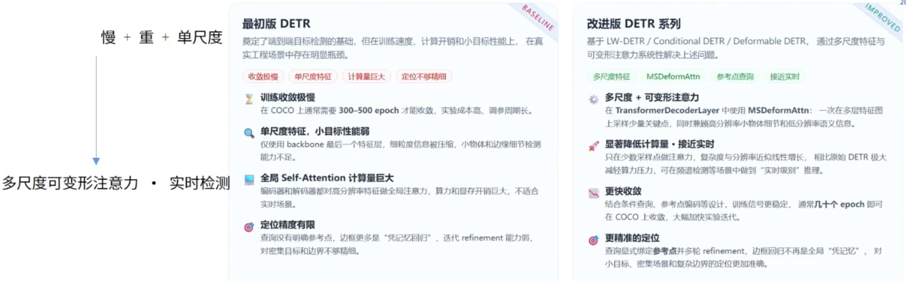
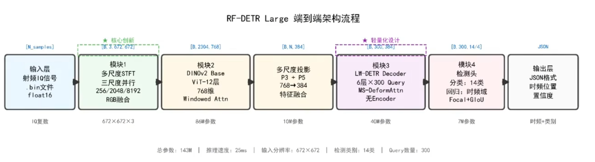
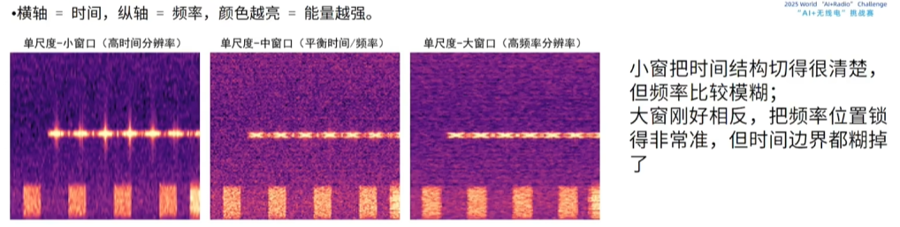
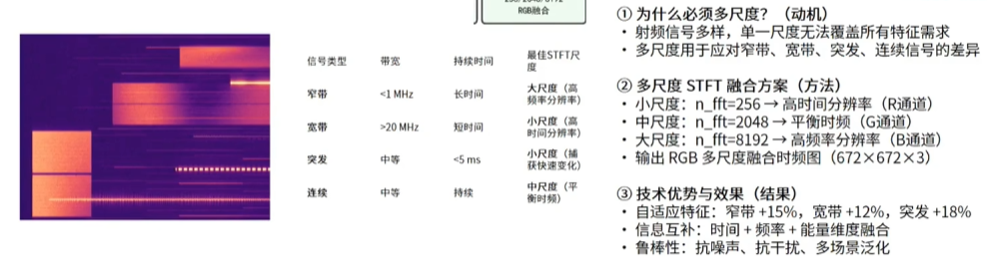

## 传统信号处理方法
1. 能量检测
2. 循环平稳特征检测

（什么是瀑布图？有一队那里好像就是瀑布图？）

## 传统模型的架构和问题
传统模型 即 Faster R-CNN 和 YOLO：
1. 流程：
2. 问题：
   1. 手工设计anchor
   2. 依赖NMS后处理
   3. 不适配小目标
   4. 超参数众多（anchor / nms / iou）
   5. 难以并行化：RoI操作依赖区域提议，限制并行效率（这什么意思？）

## 模型架构
选择的模型是 RF-DETR

完整架构

多尺度STFT：

海森堡不确定性

（如何做到多个n_fft最后都是672的？）