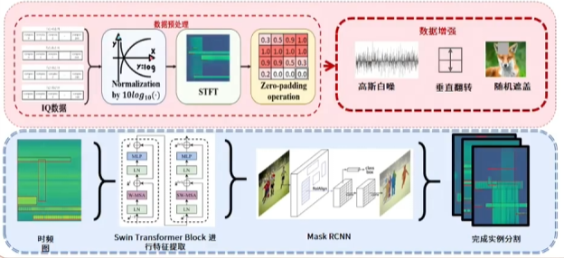
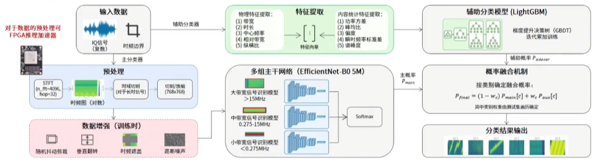

## 比赛任务的特点与需求
难点：
1. IQ数据分布异构性（采样率 / 带宽范围 / 时间长度 等信息的不同）
2. 信号在频谱上类似 且 存在大面积重叠，难以区分
3. 难以一次做到区域识别和信号分类（真的难吗）

实例分割 + 信号分类
1. 分割模型：以 swin transformer（swin-tiny-patch4-window7-224） 为特征提取层的 Mask R-CNN 网络；
2. 分类模型：融合深度学习与统计特征的多模型分类架构；

## 分割模型：
架构：

数据增强：
1. 高斯白噪
2. 垂直翻转
3. 随机遮盖

## 分类模型：
架构：

其它优化措施：
1. 自适应切片
2. 动态权重优化机制：贪心搜索算法 以 最大化验证集mAP