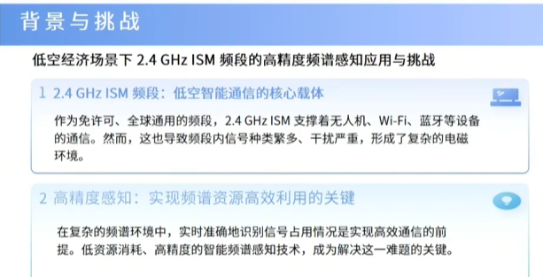
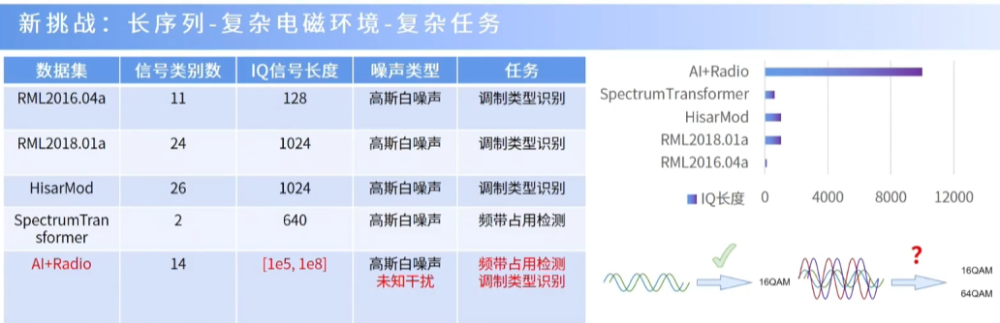
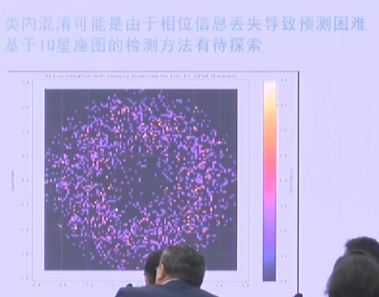

## 背景与挑战

挑战：针对数据集分析

超长序列 -> 使用STFT（时频信息分离、抑制时域重叠干扰、数据输入维数下降约59%）（数据输入维数是什么意思？）

海森堡不确定性：低频率分辨率看不清、高频率分辨率看不快

三大难题：
1. 窄带检测
2. 类内调制识别困难（特征微弱）：“使用时频图丢失相位信息”
3. 非高斯噪声混叠（特征干扰）：传统去噪解决的是高斯白噪，现在是多个有用信号的重叠

## 针对难题1
宽窄带双分支并行

## 针对难题2
