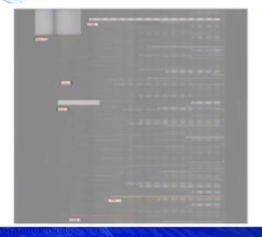
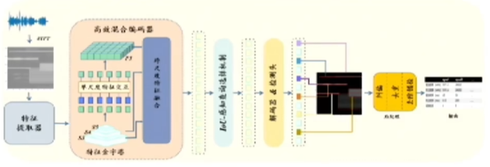
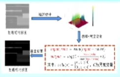

## 面临的挑战
1. 背景信号干扰严重
   
   （需要使用dB坐标来画，确实发现过，而且很可能是Class 9误报的根源）
2. 目标信号存在交叠
3. 窄带信号难以检测

## 算法创新性
知识引导与数据驱动（这是什么黑话？）

框架：

1. 时频图预处理：去噪 + 尺度变换
   
   （看起来很像从dB到线性，但好像WiFi信号看得清）
2. 跨尺度特征融合：
3. 检测结果后处理：纠偏、去重、去干扰

## 技术领先性
1. 检测精度高（窄带信号可以说它的漏检率低）
2. 鲁棒性好（应该是泛化性好，即训练集、公开测试集、私有测试集上mAP接近）
3. 推理速度快（预处理+模型）

## 专家提问：
问题：模型结构？
回答：以DETR为框架，...