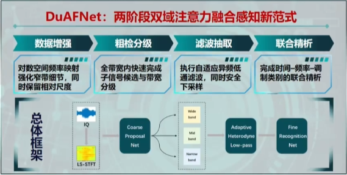
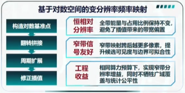
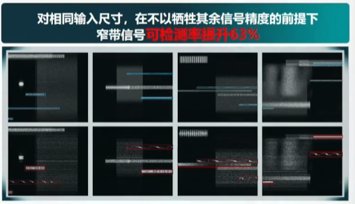
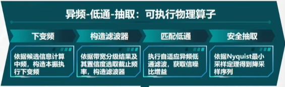
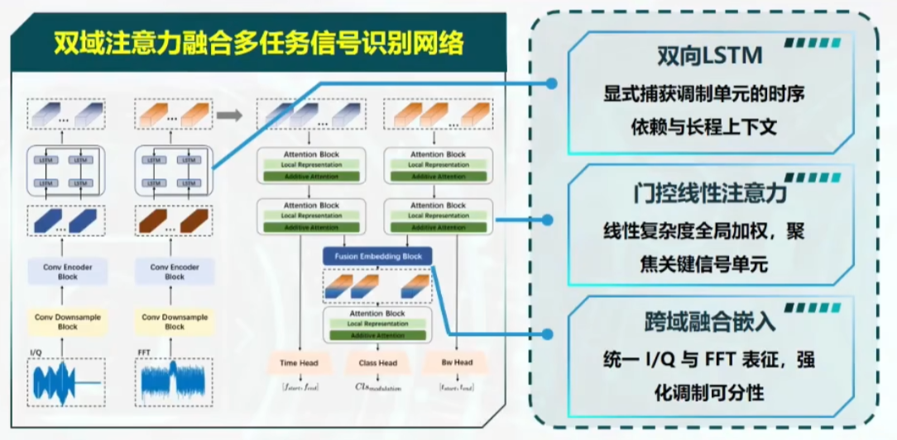
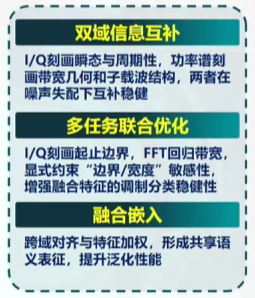

## 聚焦检测识别 重塑低空安全
1. 宽检测范围：数据量大，计算负荷重，实时性差；
2. 复杂环境：噪声背景复杂、干扰强、目标信号容易被淹没；
3. 调制方式多样：多制式共存、易混淆、窄带信号检测识别难；

高鲁棒、高精度、低虚警、轻量化、智能化

电磁环境**强非平稳**

## 系统设计：总体框架

（对数空间频率映射 是什么？）
（自适应外差低通滤波器 是什么？）

（我理解：第一阶段找到信号的时频位置，第二阶段通过滤波“取出”信号进行具体的时频定位和类别识别）

## 核心设计1：基于对数空间的变分辨率频率映射

（看右下角的图片，这是如何做到宽带信号形态几乎不变的情况下窄带信号放大这么多）

（意思是，把频率轴从线性变为对数吗？）

“依靠雅克比能量修正插值，做到整带能量一致性”
（这是什么意思？）

## 核心设计2：带宽感知粗检 与 自适应异频低通
带宽感知粗检：
使用 YOLO

自适应异频低通：

（感觉和我的stage2的操作很像）

## 核心设计3：基于双域注意力融合的精细识别

