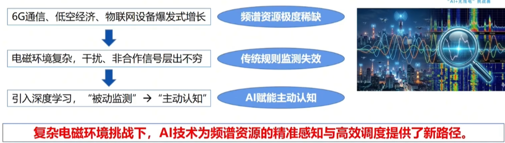
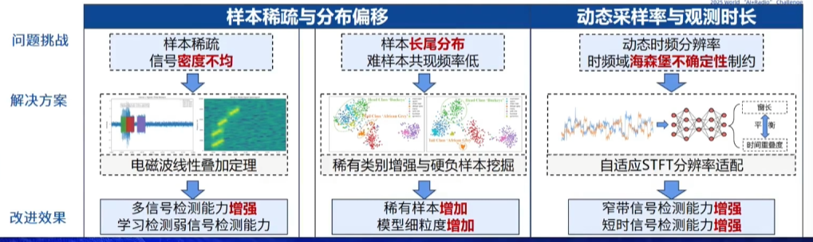
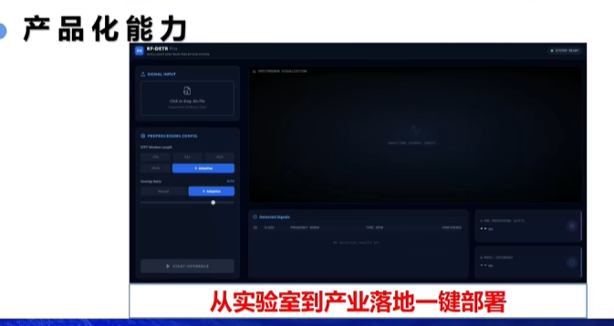
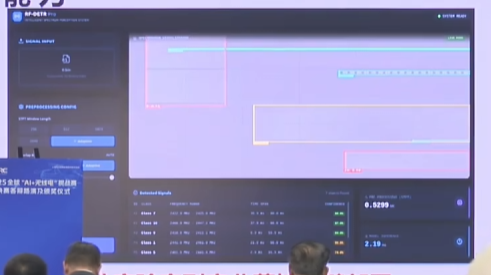

## 研究背景

## 技术路线
### 架构创新
比较YOLO和RF-DETR：
1. YOLO是CNN，是局部感受野 -> RF-DETR是Transformer，是全局注意力（好像是选择性的来着？）
2. YOLO后处理繁琐 -> RF-DETR是端到端的

### 模型设计
引入视觉大模型（DINOv2）提取射频信号特征；

### 数据优化

（什么是长尾分布？）

## 前端设计

## 提问：
在数据增强时，选择样本之间直接线性叠加，假如是相干波怎么办？（什么是相干波？）