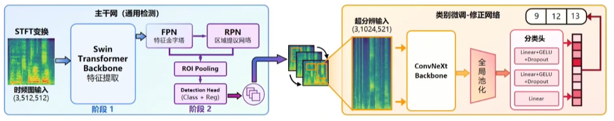
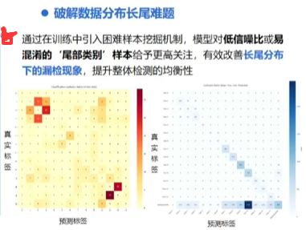

## 市场需求
1. 频谱治理危机
2. 产业规模与需求
3. 无线信号检测挑战
   1. 信号特征高度相似，精细分类难；
   2. 传统方法依赖人工，泛化差，效率低（复杂多变的动态电磁环境下专家特征设计泛化能力弱、计算复杂度高）

## 目标场景
需求：
1. 准确率高；
2. 抗干扰能力强（干扰信号）；
3. 低时间/空间复杂度；

## 初赛
（省略）

## 决赛
模型架构：

（阶段2 可能是 Fast R-CNN？）
（修正网络只用于精调Class 9/12/13）

困难样本挖掘机制：OHEM（Online Hard Example Mining）

（什么是长尾分布？）
“希望困难样本更加激进地更新模型权重”

mlp mixer (by google)
