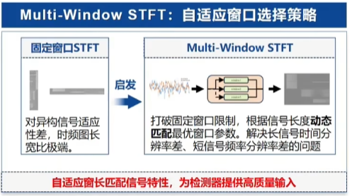
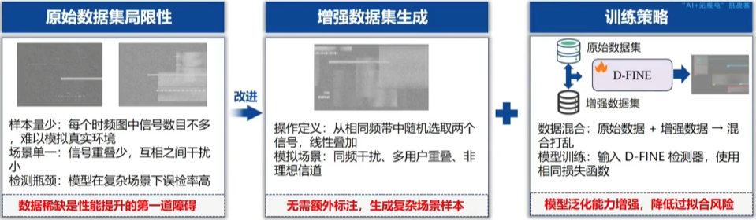
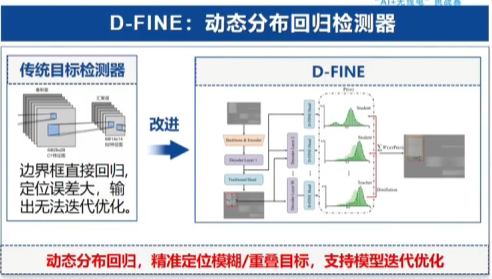
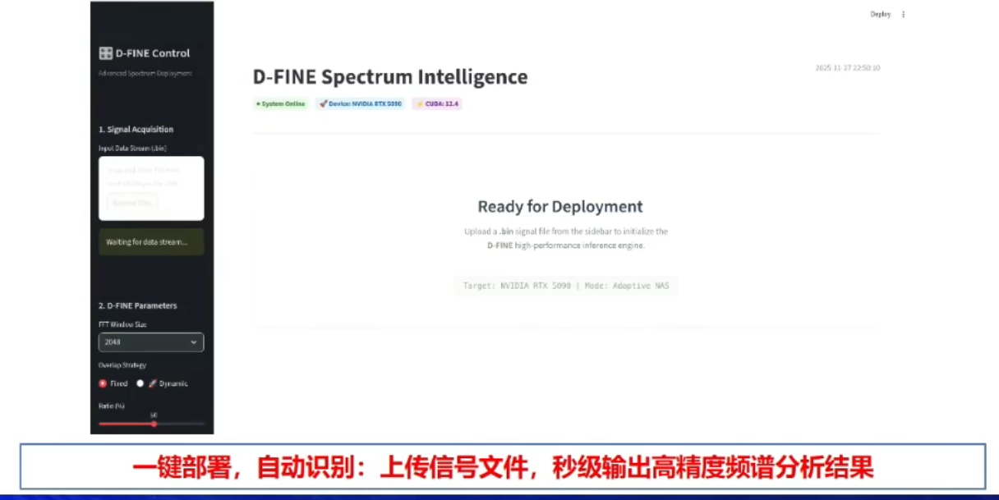
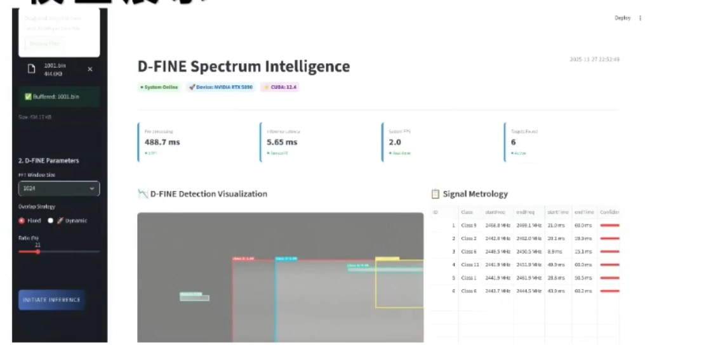

## 研究背景
传统方法：
1. 能量检测（拉完了）
2. 要求循环平稳
3. 抗噪性差；
4. 人工特征提取繁琐

## 技术路线
1. 多窗口STFT：信号长度差异大 -> 自适应检测，动态分配窗口长度，生成均衡时频图；
   
   “1024、2048和4096”
2. 数据增强：时域扰动、频域扰动、信号混合、信号几何变换；
   
3. D-FINE目标检测器：信号边界模糊且重叠 -> 动态分布回归、迭代精炼机制、知识蒸馏增强（这什么黑话？）
   

## 前端

